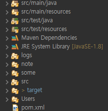

# SPRING_MVC 기초

 **[프로젝트구조](프로젝트-구조)** /
 **[Maven](#Maven)** /
 **[Lombok](#Lombok)** /
 **[log4j](#Log4j)** /
 **[junit](#Junit)** /
 **[의존성 주입](의존성-주입)** /
 **[SpringMVC](#SpringMVC)** /
 **[컨트롤러](컨트롤러)** <br>
 
 **[DB연결](DB연결)** /
 **[계층](#계층)** <br>
 
 **[REST](#REST)** /
 **[Ajax](#Ajax)** <br>


## 프로젝트 구조
>	
>- src/main/java : 자바 코드를 작성하는곳 <br>	- src/main/java : 자바 코드를 작성하는곳 <br>
>- src/main/resources : 자바 코드를 실행할 때 필요한 파일들을 보관하는 곳	- src/main/resources : 자바 코드를 실행할 때 필요한 파일들을 보관하는 곳


>- src/test/java : 작성한 자바 코드의 테스트를 작성 하는곳	- src/test/java : 작성한 자바 코드의 테스트를 작성 하는곳
>- src/test/resources : 테스트 코드를 실행할 때 필요한 파일들을 보관하는 곳	- src/test/resources : 테스트 코드를 실행할 때 필요한 파일들을 보관하는 곳


>- src : 웹 코드를 작성하는 곳 	- src : 웹 코드를 작성하는 곳 
  - root-context.xml : 스프링 프로젝트 전체 설정 파일	  - root-context.xml : 스프링 프로젝트 전체 설정 파일
  - servlet-context.xml : DispatcherServlet을 자바 코드없이 다룰 수 있는 설정 파		  - servlet-context.xml : DispatcherServlet을 자바 코드없이 다룰 수 있는 설정 파일
  
>- pom.xml : Maven 설정 파일	- pom.xml : Maven 설정 파일
>- target : 실제로 만들어질 프로젝트를 미리 볼 수 있음	- target : 실제로 만들어질 프로젝트를 미리 볼 수 있음
## Maven

## Lombok
  
## Log4j
 
## Junit
  
## 의존성 주입

## SpringMVC
 
## 컨트롤러

## DB연결

## 계층

## REST
 ### REST란
  - Mapping이름으로 URI의미를 표현
	- 이 형식을 따른 시스템을 RESTful이라고 한다.
	- RESTful을 따르면 웹서버가 웹 브라우저 뿐만이 아니라 모바일 앱과도 연결될 수 있다
  - 하나의 URI만 가지고도 CRUD를 모두 구현할 수 있다.
  ```java
  @PostMapping // CREATE
  @GetMapping // READ
  @PutMapping // UPDATE(전체)
  @PatchMapping // UPDATE(일부)
  @DeleteMapping // DELETE
  ```
 ### 추가할 Maven
  - jackson-databind
  - jackson-dataformat-xml
  - gson

 ### 어노테이션
 ```java
 @RestController
 public class RestSampleController {
 ```
- 일반 컨트롤러와 다르게 뷰로 포워드하지 않고 데이터를 바로 반환하는 컨트롤러
- 일반 컨트롤러에서 @ResposneBody 어노테이션을 사용해 적용할 수도 있다.
```java
@PostMapping(value = "/employee/create",
            consumes = "application/json",
            produces = "text/plain; charset=UTF-8"
				)
public ResponseEntity<Employee> createEmployee(@RequestBody Employee new_emp) {
```
- Jackson-databind와 함께 사용하면 JSON 또는 XML로 전달된 데이터를 간편하게 VO로 변환해준다.
## Ajax
  ### Asynchronous JavaScript and XML (or JSON) / 웹서버 비동기 통신
 - 페이지를 변화시키지 않으면서 웹 서버로 요청을 보낸다.
 - 보낸 요청이 도착하면 readyState값이 변한다.
 - readyState값 0-UNSET / 1-OPEND / 2-SEND / 3-LOADING / 4-DONE 
 
 ### 예제
 ```javascript
 // 요청 객체
 xhr = new XMLHttpRequest();
 
 // readtState 변화 감지이벤트
 xhr.onreadystatechange = function() {}
 
 // 매핑 방식, 주소, 비동기 여부
 xhr.open('GET/POST/...', uri, true) // 1
 
 // 
 xhr.send // 2
 ```
 > ### Jquery
 ```javascript
 $("#id속성").click(function(){
	$.ajax({
		// 메서드 지정
		type: "POST",
		
		// 매핑 경로
		url: "/practice_mvc/rest/employee",	
		
		// JSON.stringify() - json 타입으로
		data: JSON.stringify({
			data1: $('[name="data1"]').val(),
			// ...
		}),
		
		// json 타입으로 넘김
		contentType: 'application/json',
		
		// 성공 했을 때 메서드
		success: function(){
			alert('성공');
		},
		
		// 실패 했을 때 메서드
		error: function(){
			alert('실패')	;
		}
	});
	
});
 ```
